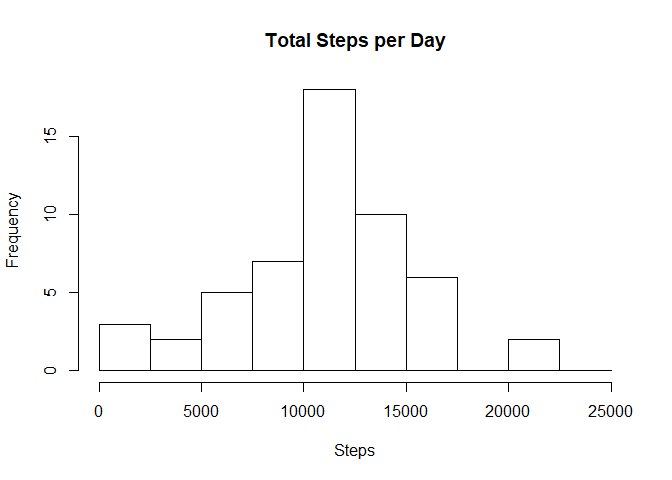
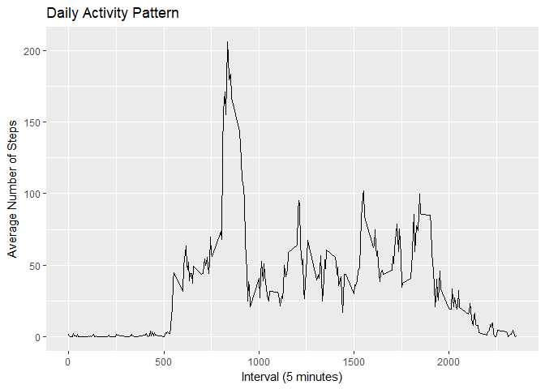
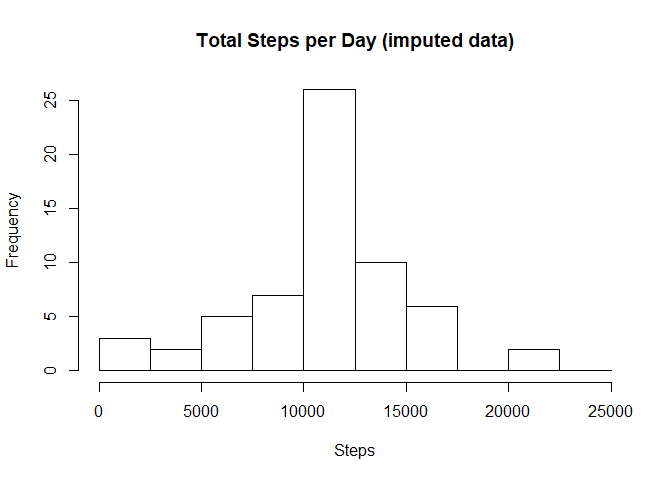
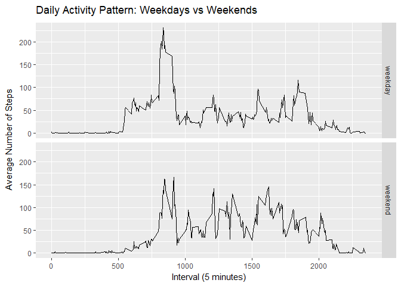

## Loading and preprocessing the data

```r
library(ggplot2)
library(timeDate)
```

```
## Warning: package 'timeDate' was built under R version 3.5.1
```

```r
#File download. If file does not exist, download to working directory.
if(!file.exists("activity.zip"))
{download.file("https://d396qusza40orc.cloudfront.net/repdata%2Fdata%2Factivity.zip", "activity.zip",mode = "wb")}

# File unzip. If file does not exist in the directory, unzip.
if(!file.exists("activity.csv"))
{unzip("activity.zip", files = NULL, exdir=".")}

activity <- read.csv(file="activity.csv", header=TRUE)
```


## What is mean total number of steps taken per day?

```r
# Calculate total steps per day
totsteps <- aggregate(steps ~ date, activity, sum, na.rm=TRUE)

# Plot the total number of steps taken per day
hist(totsteps$steps,
     breaks=seq(0, 25000,2500),
     main = "Total Steps per Day",
     xlab = "Steps")
```

<!-- -->

```r
# Mean and median of total steps taken per day
mean(totsteps$steps)
```

```
## [1] 10766.19
```

```r
median(totsteps$steps)
```

```
## [1] 10765
```

## What is the average daily activity pattern?

```r
# Calculate mean steps per interval
mean_steps <- aggregate(steps ~ interval, activity, mean, na.rm=TRUE)

# Plot the mean steps per interval
ggplot(mean_steps, aes(x = interval, y = steps)) +
  geom_line() +
  ggtitle("Daily Activity Pattern") +
  xlab("Interval (5 minutes)") +
  ylab("Average Number of Steps")
```

<!-- -->

```r
# Interval with maximum number of steps
mean_steps[which.max(mean_steps$steps),]
```

```
##     interval    steps
## 104      835 206.1698
```

## Imputing missing values

```r
# Find missing values
missing <- is.na(activity$steps)

# Fill missing values
newactivity <- transform(activity, 
  steps = ifelse(is.na(activity$steps),
  mean_steps$steps[match(activity$interval, mean_steps$interval)],activity$steps))

# Plot the total number of steps taken per day (imputed data)
totsteps2 <- aggregate(steps ~ date, newactivity, sum)
hist(totsteps2$steps,
     breaks=seq(0, 25000,2500),
     main = "Total Steps per Day (imputed data)",
     xlab = "Steps")
```

<!-- -->

```r
# Mean and median of total steps taken per day (imputed data)
mean(totsteps2$steps)
```

```
## [1] 10766.19
```

```r
median(totsteps2$steps)
```

```
## [1] 10766.19
```

```r
#Differences (mean and median) with non imputed dataset
mean(totsteps2$steps) - mean(totsteps$steps)
```

```
## [1] 0
```

```r
median(totsteps2$steps) - median(totsteps$steps)
```

```
## [1] 1.188679
```
The mean is the same for the imputed and non-imputed datasets but the median is slightly higher (1.189) for the imputed dataset.

## Are there differences in activity patterns between weekdays and weekends?

```r
# Create a new factor variable in the dataset with two levels - "weekday" and "weekend" indicating whether a given date is a weekday or weekend day
newactivity$date <- as.Date(newactivity$date)
newactivity$day <- ifelse(isWeekday(newactivity$date)==TRUE, "weekday", "weekend")

# Make a panel plot containnig a time-series plot of the 5-minute interval
# and the average number of steps taken across all weekdays or weekends
meanstepsbydaytype <- aggregate(steps ~ interval + day, newactivity, mean)

ggplot(meanstepsbydaytype, aes(interval, steps)) + 
  geom_line() + facet_grid(day ~ .) +
  labs(x="Interval (5 minutes)", y=expression("Average Number of Steps")) + 
  labs(title=expression("Daily Activity Pattern: Weekdays vs Weekends"))
```

<!-- -->
